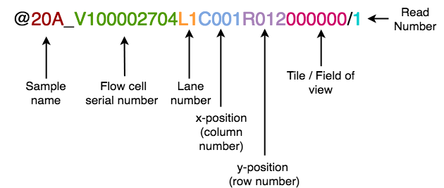

# BGIvsIllumina_scRNASeq
Code repository for the publication "Comparative performance of the BGI and Illumina sequencing technology for single-cell RNA-sequencing" by Senabouth et al. 2019.

## Data repository
[...To come...]

## Pre-processing
### Reformat filenames
The Cell Ranger pipeline from 10x Genomics requires filenames to be formatted in a specific manner. As we have the reads organised into paired end reads without an index read file, we need to add the index information to the filename.


### Reformat headers
Base calls from the BGI MGISEQ-2000 were converted into FastQ format, but the BGI headers were incompatible with the 10x Genomics Cell Ranger 2.2 pipeline as it expects headers to be in Illumina format.

This is one of the entries from the BGI FastQ files:
```
@20A_V100002704L1C001R012000000/1
ACCTTTAAGACCGGATCGCCTTTATC
+
FCFCF7EE3*FFF=>EDAFBF.BFFE
```

This header contains the following information:



These elements can be used to build an Illumina header, though additional information is required.

The script convertHeaders.py converts the above header into the Illumina format as shown below. 

```
@MGISEQ2000:1:V100002704:1:3:1:12 1:N:0:20A
ACCTTTAAGACCGGATCGCCTTTATC
+
FCFCF7EE3*FFF=>EDAFBF.BFFE
```

Illumina headers have the following structure (as taken from [here](http://support.illumina.com/content/dam/illumina-support/help/BaseSpaceHelp_v2/Content/Vault/Informatics/Sequencing_Analysis/BS/swSEQ_mBS_FASTQFiles.htm)):

@\<instrument>:\<run number>:\<flowcell ID>:\<lane>:\<tile>:\<x-pos>:\<y-pos> \<read>:\<is filtered>:\<control number>:\<sample number>

| Element          | Requirements                                    | Description                                                                                                                                                                 |
|------------------|-------------------------------------------------|-----------------------------------------------------------------------------------------------------------------------------------------------------------------------------|
| @                | @                                               | Each sequence identifier line starts with @                                                                                                                                 |
| \<instrument\>     | Characters allowed:a–z, A–Z, 0–9 and underscore | Instrument ID                                                                                                                                                               |
| \<run number>    | Numerical                                       | Run number on instrument                                                                                                                                                    |
| \<flowcell ID>    | Characters allowed: a–z, A–Z, 0–9               | Flowcell ID                                                                                                                                                                 |
| \<lane>           | Numerical                                       | Lane number                                                                                                                                                                 |
| \<tile>           | Numerical                                       | Tile number                                                                                                                                                                 |
| \<x_pos>          | Numerical                                       | X coordinate of cluster                                                                                                                                                     |
| \<y_pos>          | Numerical                                       | Y coordinate of cluster                                                                                                                                                     |
| \<read>           | Numerical                                       | Read number. 1 can be single read or Read 2 of paired-end                                                                                                                   |
| \<is filtered>    | Y or N                                          | Y if the read is filtered (did not pass), N otherwise                                                                                                                       |
| \<control number> | Numerical                                       | 0 when none of the control bits are on, otherwise it is an even number. On HiSeq X and NextSeq systems, control specification is not performed and this number is always 0. |
| \<sample number>  | Numerical                                       | Sample number from sample sheet                                                             
           
Please note that this script will set the instrument ID to MGISEQ-2000.

